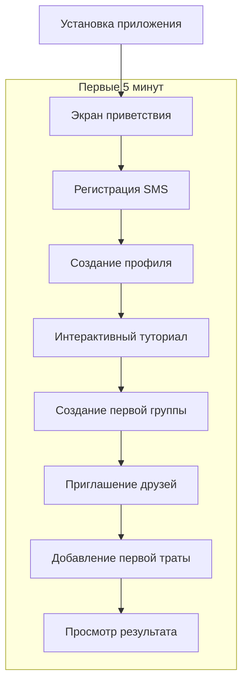
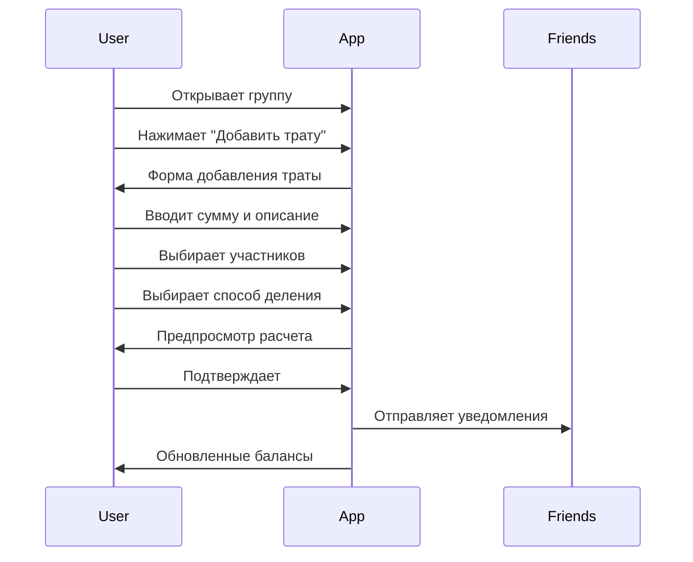
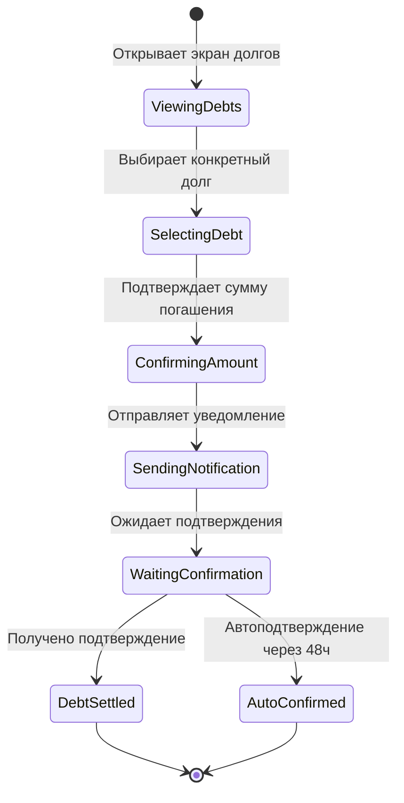

# VibeSplit User Journey Analysis

## Overview

Анализ пользовательских путей для VibeSplit с акцентом на снижение трения при обсуждении денег и обеспечение быстрой ценности в первые 5 минут использования.

## Table of Contents

1. [Key Personas Journey Mapping](#key-personas-journey-mapping)
2. [Critical User Flows](#critical-user-flows)
3. [Pain Points & Solutions](#pain-points--solutions)
4. [Information Architecture](#information-architecture)
5. [Emotional Journey Mapping](#emotional-journey-mapping)
6. [Russian Cultural Considerations](#russian-cultural-considerations)

## Key Personas Journey Mapping

### Persona 1: "Социальная Алиса" (Primary Persona)
**Context**: Ужин в ресторане с 5 друзьями, все заказывают разное + общие блюда

#### Current Pain Points (Without VibeSplit):
1. **Математический стресс**: Сложные расчеты в уме или калькуляторе
2. **Социальная неловкость**: Просьба к друзьям оплатить долги
3. **Забывчивость**: Потеря деталей через несколько дней
4. **Недоверие**: Подозрения в неточности расчетов

#### Optimized Journey with VibeSplit:

**Pre-Dinner (Planning Phase)**
```
Настроение: Excited → Organized
Действия: Создает группу "Ужин в Фусионе" → Приглашает друзей → Устанавливает контекст
Время: 2 минуты
Результат: Все участники уведомлены, группа готова
```

**During Dinner (Expense Tracking)**
```
Настроение: Relaxed → Confident
Действия: Фотографирует чек → Быстро добавляет трату → Выбирает участников → Автоматическое деление
Время: 1 минута на трату
Результат: Все видят актуальные балансы в реальном времени
```

**Post-Dinner (Settlement)**
```
Настроение: Satisfied → Accomplished  
Действия: Просматривает итоговые долги → Отправляет деликатные напоминания → Получает подтверждения
Время: 30 секунд на долг
Результат: Честные расчеты без конфликтов, сохраненные отношения
```

### Persona 2: "Практичный Дмитрий" (Secondary Persona)
**Context**: Командировка с коллегами, совместные покупки и расходы

#### Optimized Journey with VibeSplit:

**Pre-Trip Planning**
```
Настроение: Analytical → Prepared
Действия: Создает группу "Командировка СПб" → Устанавливает правила → Добавляет коллег
Focus: Точность, прозрачность, контроль
```

**During Trip (Expense Management)**
```
Настроение: Efficient → Confident
Действия: Сканирует QR чеков → Детальная категоризация → Проверка расчетов
Focus: Автоматизация рутины, точность данных
```

**Post-Trip Analysis**
```
Настроение: Analytical → Satisfied
Действия: Экспорт отчетов → Анализ трендов → Архивирование группы
Focus: Историческая отчетность, оптимизация будущих поездок
```

### Persona 3: "Студентка Катя" (Tertiary Persona)  
**Context**: Общежитие, заказ еды на комнату, каждый рубль важен

#### Optimized Journey with VibeSplit:

**Daily Micro-Expenses**
```
Настроение: Cautious → Secure
Действия: Быстрое добавление мелких трат → Точное отслеживание копеек → Мягкие напоминания
Focus: Финансовая дисциплина, соблюдение бюджета
```

## Critical User Flows

### 1. Onboarding Flow (5-Minute Value)



**Time Breakdown:**
- Регистрация: 1 мин
- Профиль: 30 сек
- Туториал: 1.5 мин
- Группа + друзья: 1 мин
- Первая трата: 1 мин
**Total: 5 минут до получения ценности**

### 2. Primary Task Flow: Adding Expense



**Key Design Decisions:**
- **Предпросмотр перед сохранением**: Снижает ошибки
- **Мягкие уведомления**: Избегает агрессивности
- **Визуальный фидбек**: Подтверждение действий

### 3. Debt Settlement Flow



## Pain Points & Solutions

### Identified Pain Points from Research

#### 1. Social Awkwardness (Социальная неловкость)
**Problem**: Неловко напоминать друзьям о долгах
**VibeSplit Solution**: 
- Мягкие, неагрессивные уведомления
- Системные напоминания вместо персональных
- Позитивный тон сообщений ("Друзья отметили погашение!" вместо "Вы должны")

#### 2. Mathematical Complexity (Сложность расчетов)
**Problem**: Ошибки в ручных расчетах, особенно при неравномерном делении
**VibeSplit Solution**:
- Алгоритм минимизации транзакций
- Визуальный предпросмотр перед сохранением
- Автоматическое округление с прозрачным объяснением

#### 3. Transparency Issues (Недостаток прозрачности)
**Problem**: Подозрения в неточности расчетов
**VibeSplit Solution**:
- Детальная история всех операций
- Пошаговое объяснение расчетов
- Возможность проверки математики

#### 4. Memory Loss (Забывчивость)
**Problem**: Потеря деталей трат через время
**VibeSplit Solution**:
- Фотографии чеков как доказательство
- Автоматические временные метки
- Поиск по описаниям и датам

### Russian-Specific Solutions

#### Cultural Sensitivity Features:
1. **"Мягкие" формулировки**: "Предлагаем погасить" вместо "Вы должны"
2. **Коллективная ответственность**: "Группе нужно урегулировать" вместо персональных обвинений
3. **Позитивное подкрепление**: Празднование успешных погашений
4. **Приватность**: Долги видны только участникам, а не всем друзьям

## Information Architecture

### App Structure Hierarchy

```
VibeSplit App
├── 🏠 Главная (Dashboard)
│   ├── Мой баланс (общий)
│   ├── Активные группы (список)
│   ├── Последние операции (лента)
│   └── Быстрые действия (FAB)
│
├── 👥 Группы
│   ├── Список всех групп
│   ├── Детали группы
│   │   ├── Баланс группы
│   │   ├── Участники
│   │   ├── История трат
│   │   └── Настройки группы
│   └── Создание новой группы
│
├── 💰 Траты
│   ├── Добавление новой траты
│   │   ├── Сумма и описание
│   │   ├── Выбор участников
│   │   ├── Способ деления
│   │   └── Подтверждение
│   ├── Редактирование траты
│   └── История всех трат
│
├── 🏦 Долги
│   ├── Кому я должен
│   ├── Кто должен мне
│   ├── Погашение долгов
│   └── История погашений
│
└── ⚙️ Профиль
    ├── Настройки аккаунта
    ├── Уведомления
    ├── Конфиденциальность
    ├── Помощь и поддержка
    └── О приложении
```

### Navigation Patterns

#### Primary Navigation (Tab Bar)
1. **Главная** - Dashboard с общим балансом
2. **Группы** - Управление группами трат
3. **Долги** - Текущие обязательства
4. **Профиль** - Настройки и аккаунт

#### Secondary Navigation (In-Screen)
- **Floating Action Button (FAB)**: Быстрое добавление трат
- **Pull-to-refresh**: Обновление данных
- **Swipe actions**: Быстрые действия по элементам списка
- **Bottom sheets**: Дополнительные опции и фильтры

## Emotional Journey Mapping

### First-Time User Emotional Arc

```
Anxiety → Curiosity → Confidence → Satisfaction → Advocacy
   |          |           |            |             |
"Сложно?"  "Понятно!"  "Работает!"  "Удобно!"  "Советую!"
```

**Stage 1: Initial Anxiety (0-2 min)**
- *Emotions*: Сомнения, опасения сложности
- *Design Response*: Простой onboarding, минимальные формы
- *Success Metric*: Пользователь завершает регистрацию

**Stage 2: Growing Curiosity (2-5 min)**
- *Emotions*: Интерес, желание попробовать
- *Design Response*: Интерактивный туториал с реальными примерами
- *Success Metric*: Создание первой группы

**Stage 3: Building Confidence (5-10 min)**
- *Emotions*: Понимание, контроль ситуации
- *Design Response*: Четкий фидбек, предпросмотр результатов
- *Success Metric*: Успешное добавление первой траты

**Stage 4: Satisfaction (10+ min)**
- *Emotions*: Удовлетворение, облегчение
- *Design Response*: Положительные подтверждения, визуализация пользы
- *Success Metric*: Приглашение друзей в группу

**Stage 5: Advocacy (Days/Weeks)**
- *Emotions*: Лояльность, желание рекомендовать
- *Design Response*: Sharing features, referral программы
- *Success Metric*: Органические рекомендации

### Ongoing Usage Emotional Patterns

#### Positive Emotional Triggers:
- ✅ Успешное погашение долга
- 📊 Просмотр экономии времени
- 🎉 Закрытие группы без долгов
- 👥 Приглашение нового друга

#### Negative Emotional Triggers to Mitigate:
- ❌ Технические ошибки синхронизации
- 💸 Большая сумма долга
- ⏰ Долгое ожидание подтверждения
- 🤝 Конфликты с друзьями

## Russian Cultural Considerations

### Communication Style Adaptations

#### Directness vs. Politeness Balance:
```javascript
// Aggressive (avoid)
"Вы должны Алисе 500 рублей. Оплатите немедленно."

// Optimal Russian style
"Алиса оплачивала общий счет. Ваша часть: 500 ₽"
```

#### Collective vs. Individual Framing:
```javascript
// Individual blame (avoid)  
"Дмитрий не оплатил свой долг"

// Collective responsibility (preferred)
"В группе остались неоплаченные расходы"
```

### Russian Behavioral Patterns Integration:

1. **Застольные традиции**: Специальная поддержка ресторанных счетов
2. **Дачная культура**: Групповые покупки для загородных поездок
3. **Студенческая экономика**: Поддержка очень мелких сумм (от 1 рубля)
4. **Корпоративная культура**: Рабочие обеды и командировки

### Localization Considerations:

#### Currency & Number Formatting:
- Российский рубль (₽) как основная валюта
- Форматирование: "1 500,50 ₽" (пробел как разделитель тысяч, запятая для копеек)
- Поддержка копеек с умным округлением

#### Date & Time Patterns:
- DD.MM.YYYY формат дат
- 24-часовой формат времени
- Российские праздники в календарных интеграциях

#### Linguistic Nuances:
- Склонения имен и сумм
- Формальные/неформальные обращения
- Региональные особенности (Москва vs. регионы)

## Success Metrics per Journey Stage

### Onboarding (0-5 min)
- **Registration completion**: >85%
- **Profile creation**: >80%
- **First group creation**: >70%
- **First expense addition**: >60%

### Early Usage (Day 1-7)
- **Daily active usage**: >40%
- **Friend invitations sent**: >2 per user
- **Groups with >2 expenses**: >50%

### Habit Formation (Week 2-4)
- **Weekly expense additions**: >3
- **Debt settlements**: >80% completion rate
- **Return usage after first settlement**: >70%

### Long-term Engagement (Month 2+)
- **Monthly active users**: >60%
- **Groups with regular activity**: >3 per active user
- **Net Promoter Score**: >50

## Related Documentation

- [Design System Style Guide](../design-system/style-guide.md)
- [User Authentication Flow](./user-authentication/README.md)
- [Expense Sharing Patterns](./expense-sharing/README.md)
- [Accessibility Guidelines](../accessibility/guidelines.md)

## Next Steps

1. **High-fidelity wireframes** based on these journey maps
2. **Interaction prototypes** for critical flows validation
3. **Usability testing** with Russian users
4. **Cultural validation** with target personas

## Last Updated
**Version 1.0.0** - Complete user journey analysis with Russian cultural considerations  
**Date**: 2025-01-11  
**Next Review**: 2025-01-18